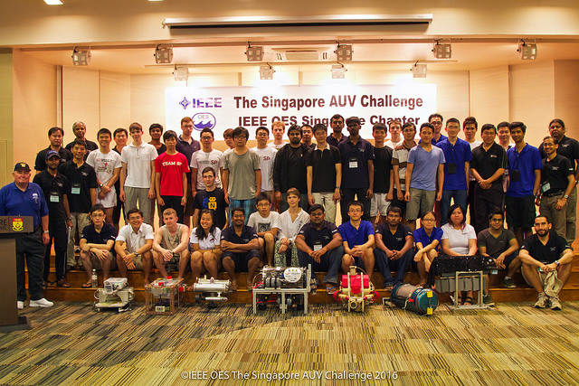
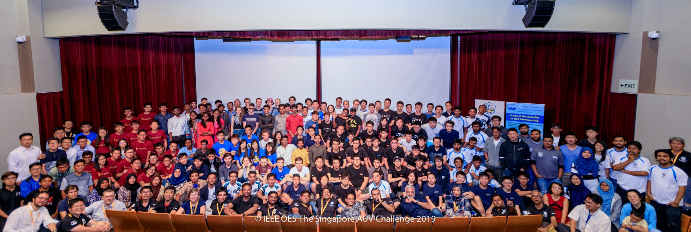

# SAUVC manual

### Design to compete. Destined to explore.

### 1. Introduction
Singapore AUV challenge was first conducted in year 2013 with the aim of raising awareness about marine science & technology and growing the marine robotics and related community in Singapore. Over the years, the challenge has witnessed exponential growth in terms of reach and number of participants. We had 6 teams in year 2013, that has grown to around 60 teams who registered for the challenge in year 2019.

**2013**

**2019**

While the core committee of people who started the event has largely remained the same, the size of the committee has also grown from 2013 to date. Additionally, the various functions that needs managing has also grown. The knowledge of how to go about the various aspects of organizing SAUVC, has been passed from one committee to another, year after year.

As with all growing teams/organizations, especially one that comprises entirely of volunteers, being able to work independently in an agile fashion, is a key factor. In order to achieve this, we need to have a common repository of the knowledge that has accumulated over the years. This is the intent of this manual.

This manual is meant as a guide to various aspects of SAUVC such as:
- Structure of the SAUVC committee
- Roles and responsibilities of each of the sub-committees/members
- General time-line from the formation of a new committee leading all the way to the event and the post-event debrief meeting
- Recommended time-line for the major activities. E.g. announcement of the event, closing of registration etc.

### 2. Committee structure
While the actual event comprises of 3-4 days of activities (typically over a weekend), it is the culmination of a year's worth of planning and background work.

A recommended list of roles required for the SAUVC committee over the duration of the entire year is as follows:
- Chair
- Vice-chair
- Treasurer
- Secretary
- Outreach
- Logistics
- Sponsorship
- Publicity
- Technical
- Webmaster

As stated, this is not an exhaustive list of roles for the committee. Each year's committee is free to decide which roles are deemed necessary for the committee (E.g. Co-chair).

While the above list captures most of the major roles required throughout the year leading up to an event, some other roles (individual or team) are required mainly during the event, such as:
- Game master
- Judges
- Emcee(s)
- Slot manager(s)
- Trolley manger(s)
- Safety officer(s)
- Registration and/or payment-management team
- Certificate printing team
- Audio-visual/presentation preparation
- WiFi management
- Food catering/distribution
- Diving
- Media/UW photography/team interviews team etc.

This list is completely up to the committee to decide closer to the event, depending on the number of participants, venue etc. This document will focus more on the first list and provide guidelines for populating the second list closer to the event.

### 3. Roles and responsibilities
Various responsibilities associated with each of the roles and any subcommittees/additional teams that report to them, is presented in this section.

#### Chair
- Overall committee oversight
- Formal invitations to some dignitaries/groups to attend the event
- Time-line management for whole event (over the year)
- Agenda for each meeting
- > Managing international committee?
- Reporting subcommittees
  - All other committees report to chair

#### Vice-chair
- Visa invitation chair (visa letters to teams)
- Creation & management of online forms
  - Number of people & names (for certificates)
  - T-shirts & sizes
  - Dietary preferences
  - Name list finalization during registration

#### Treasurer
- Finance management
- Management of payments collected

#### Secretrary
- Meeting minutes
- Manning auvc.singapore@gmail.com email account
- Replying to Facebook messages + Reddit responses

#### Outreach
- Get more teams to participate
- All formal announcements
- Registration announcements
- Registration form preparation
- Registration page preparation
- Indemnity forms
- Team-POC management

#### Logistics
- Venue liaison
- Event/logistics management
- Program itinerary planning
- Logistics manual preparation
- Reporting subcommittees
  - Dive team
  - Certificate printing team
  - F&B team

#### Sponsorship
- Getting sponsorship

#### Publicity
- Reaching out to visitors using various outlets
  - Conventional media
  - Social media (including regular posts/updates on FB/Twitter/Instagram throughout the year to maintain interest level)
- Publicity & announcements during the event
- Emcee
- Reporting subcommittees
  - Media team (photo, video coverage)
  - Social media team

#### Technical
- Rulebook management
- Technical Q&A - forum management
- Management of judges during the event

#### Webmaster
- Managing sauvc.org website

### 4. General time-line of the event
A general time-line of the event is as follows. Y1 indicates Y1 (the year in which committee is formed) and Y2 the following year when event takes place
1. **Formation of committee and initial meeting**: March - April Y1
   * Construct next SAUVC committee
   * Decide next SAUVC dates
   * Initiate pool booking
   * Set registration format/fees
2. **Announcements on website and social media** : March - April Y1 after kickoff meeting
   * Archive previous website
   * Launch next event's website with updated dates of event, venue
3. **Update signatories for cheques** March - April Y1 after kickoff meeting
4. **Generic publicity flyer preparation**: After dates/venue fixed
5. **Update rulebook**: After kickoff meeting
   * Announce rulebook on website after updates
6. **Event update announcements on FB and website** - as and when required
7. **Set up registration form, broadcast registration link to mailing list of potential participants**: May-June Y1
8. **Registration start & end dates**: April-May Y1?
9. **Sponsorship discussions**: start from April Y1, good to semi-finalize sponsors by Feb Y2
10. **Outreach to new institutions to join as competing teams**: April Y1 till registration closure
11. **Closure of registration**: Sep Y1
12. **Assignment of team POCs**: Right after registration closure
13. **Selection of guests/speakers? **
14. **Meeting 2** - formalize on registered teams, video submissions, numbers etc
15. **Video submission deadline**: Dec Y1
16. **Publicity for visitors to attend the event**: Throughout the year, with more intensity during the 3 months before event
17. **Detailed publicity flyer preparation (with more detail on schedule)**: After schedule fixed, typically within 3 months before event
18. **Eventbrite event creation and email announcement**: After schedule fixed, typically within 3 months before event
19. **Short-listing of teams based on video submissions**: Jan Y2
20. **Collection of team details** - number of members, t-shirt sizes, dietary restrictions: After team shortlisting
21. **Issue visa invitation letters**: After team shortlisting
22. **T-shirt printing**: After receiving numbers on T-shirts, at-least a month or two before event (Feb Y2?)
23. **Sign-up event management company for logistics management**:
24. **Food order**: Feb Y2?
25. **Call for volunteers**: Jan/Feb Y2?
26. **Meeting 3** : prior to competition (include volunteers)
27. **Actual competition**
28. **Send feedback forms to teams**
29. **Debrief meeting + social dinner + committee dissolve**: After event, say Mar/Apr Y2
    * Debrief of event
    * Finances - closing of books
    * Discussion of feedback

### 5. Time-line of SAUVC 2019

| Date                              | Activity                                                     |
| --------------------------------- | ------------------------------------------------------------ |
| April 18, 2018                    | Debrief for SAUVC'18 Finances - closing of books Selection of chair/secretary for SAUVC'19 Addressing problems faced in SAUVC'18 |
| Apr. 18 - May 10, 2018            | Construct next SAUVC'19 committee                            |
| May 12, 2018                      | Sent Doodle poll - committee meeting                         |
| May 15, 2018                      | **Committee meeting** Official announcement of committee members and roles Decide SAUVC'19 dates Initiate pool booking Set registration fees  Updates to rulebook text Updates to SAUVC website Archive SAUVC'18 website and set deadline for launch of SAUVC'19 site Initiate signatories update for the SAUVC account   Event publicity (stickers & flyers for Oceans/IROS/ICRA/ASA) |
| May 18, 2018                      | Website launched                                             |
| June 12, 2018                     | Broadcast registration link to potential participants Activate Google registration form and link to website |
| June 28, 2018                     | Sent Doodle poll - committee meeting                         |
| July 6, 2018                      | **Committee meeting**  Technical committee concerns Finalize game plan Finalize registration details & website launch  Include registration and video submission deadlines on website Finalize time-lines for registration, video submission, and outcome |
| November 15, 2018                 | Deadline registration                                        |
| **November 16 -25, 2018**         | Assign POCs to each team Add names to website (do not publish) |
| November 26, 2018                 | Broadcast email to all registered teams Ask POCs to contact teams Publish updated SAUVC website |
| **Nov. 15, 2018 - Jan. 10, 2019** | POCs asked to consolidate all videos Spreadsheet shared amongst committee |
| December 31, 2018                 | Deadline: video submission Send out broadcast for deadline extension :) |
| January 10, 2019                  | Firm deadline: video submission                              |
| January 14, 2019                  | Technical committee meets to short-list teams                |
| January 15, 2019                  | Announcement of shortlisted & conditionally accepted teams  Set deadline **January 25, 2019** to submit team list, food preferences, shirt sizes. |
| **January 10 - 17, 2019**         | Shirt design committee & participants Pigeonhole: selection of colors from the committee |
| January 27, 2019                  | Update short-listed teams on website                         |
| January 29, 2019                  | Sent Doodle poll - committee meeting                         |
| January 30, 2019                  | Sent PayPal quotes to all teams with more than 6 members, accepting till event day **March 8, 2019** |
| February 11, 2019                 | **Committee meeting**  Update on sponsorship Event-day roles and responsibilities Team & participant count logistics manual |
| February 15, 2019                 | Broadcast qualifiers balloting  form to all participants Balloting between **Feb. 18 - Feb. 25, 2019** |
| February 18, 2019                 | Orders given for shirt printing, lanyards, and tote-bags     |

### 5. Time-line for each subcommittee

TODO: By each committee

### 6. Shared resources for committee

Resources include:
- Online media accounts
  - auvc.singapore@gmail.com
  - [Facebook](https://www.facebook.com/SingaporeAUVChallenge/?ref=bookmarks "SAUVC FB page")
  - [Twitter](<https://twitter.com/sauvcsg> "SAUVC Twitter")
  - [Instagram](<https://www.instagram.com/sauvcsg/> "SAUVC Instagram")
  - [Reddit](<[https://reddit.com/r/SAUVC/](https://www.reddit.com/r/SAUVC/)> "SAUVC Reddit")
  - [Flickr](<https://www.flickr.com/photos/sauvc/> "SAUVC Flickr")
  - [Github](https://github.com/sauvc "SAUVC Github")
  - [Youtube](https://www.youtube.com/channel/UCC1XR5k-A8oQUrXvRDni_YQ "SAUVC Youtube")
  - Registration, and t-shirt+diet preferences forms are on Google account of auvc.singapore@gmail.com
  - Team's feedback form is on Survey Monkey accessible from Google id of auvc.singapore@gmail.com
  - Polling for panel discussion questions is typically done on pigeonhole
  -

- Banners, standees (SAUVC banner, 2 generic standees with 'co-organized with SP', and 2 more are printed each year with that year's sponsor logos)
- Document templates/raw files
  - Visa invitation letter
  - Guest invitation letter
  - Publicity mail
  - Generic Flyers
  - Publicity Flyers
  - Logo
  - Logistics manual/Program details sent to teams
  - Master excel sheet for consolidating all team logistics/details
  TODO : Upload all docs to a Google drive folder of auvc.singapore account ?
